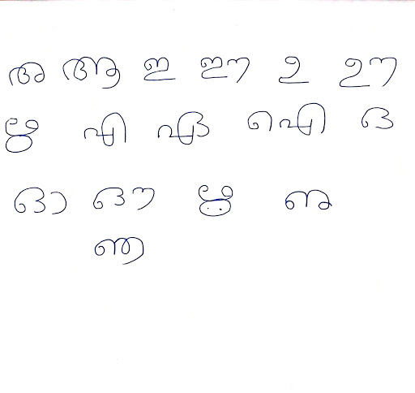
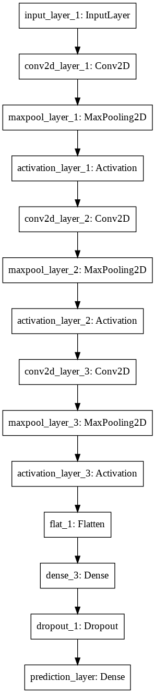
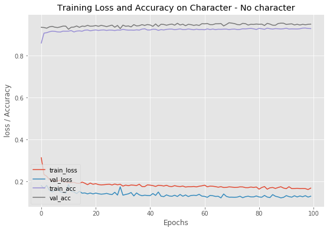

# Malayalam handwriting text recognition

Data
--------------------------
Data create from the image

Model
-----------------------------
CNN model

Training Plot
-------------------------------
This shows that model has trained good, as training and validation loss / accuracy  are close to each other.

